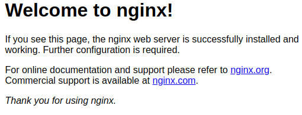

# Ansible tutorial

This will be a crash course on learning how to set up and use Ansible by examples. 

Even though all the information will be provided here, I strongly recommend to follow the tutorial for a better experience. 

This series is divided into the following parts:

* Part 1: Prerequisites
    * Install all the required software for this tutorial
* Part 2: best practices and first playbook
    * Create a role to provision the popular nginx webserver with a sample page
    * Create a playbook to use the role
* Part 3: handling the inventory
    * Variable precedence
    * Multiple environments
    * Vault and secrets
* Part 3: getting to know the internals
    * Create a custom module
* Part 4: make custom components 1
    * Create a custom filter plugin
* Part 5: make custom components 2
    * Create a custom lookup plugin
* Part 6: make roles that never fail
    * Add tests to our role


## Part 2: best practices and first playbook

### Prerequisites

Create a directory somewhere in your filesystem named `ansible`. For the purposes of the tutorial I'll assume it was created on `~/ansible`.

Change directories to the previously created directory.

### Create a role to provision the popular nginx webserver with a sample page

#### Basic directory structure
Following the provided example in the [documentation](https://docs.ansible.com/ansible/2.7/user_guide/playbooks_reuse_roles.html), the directory structure of an ansible project can be as follows:
```
site.yml
webservers.yml
fooservers.yml
roles/
   common/
     tasks/
     handlers/
     files/
     templates/
     vars/
     defaults/
     meta/
   webservers/
     tasks/
     defaults/
     meta/
```

Focusing on the `roles` directory for a moment, let's point out some things:
* The minimum that you need for any Ansible roles, using the role `common` as an example, is:
    ```
    ~/ansible/roles/common/tasks/main.yml
    ```
* The file `tasks/main.yml` will be the entrypoint for the role.
* I usually start filling up this `main.yml` file and then create all other files when necessary.

#### main.yml

We will name the role to be created as `webservers-nginx`. To proceed please follow below.

* Create the file `webservers-nginx/tasks/main.yml`
    ```
    mkdir -p webservers-nginx/roles/tasks/
    touch webservers-nginx/roles/tasks/main.yml
    ```
* Include the following content (careful with the spaces: YAML is very sensitive with this)
    ```
    ---

    - name: install the nginx reverse proxy
      apt:
        name: nginx
        update_cache: yes

    - name: enable nginx service
      systemd:
        name: nginx
        state: started
        enabled: yes
    ```

In this example we're just installing the popular Nginx, starting it, and enabling the service at boot time (so if we restart the destination host, this service will be autostarted).

### Create a playbook to use the role

Playbooks are the next level of abstraction towards the infrastructure. They can include tasks, and most importantly, the roles.

Until now we don't have any hosts to use as target to run the playbook that will have included the role `webservers-nginx`, that's about to change.

#### Creating a server using Vagrant

With Vagrant we can spin up virtual machines very easy. In this case we will spin up a particular Ubuntu Xenial image. See below:

* Initialize vagrant with an ubuntu image:
    ```
    vagrant init bento/ubuntu-16.04 --minimal
    ```
    > This will create the file `Vagrantfile`.
* Open the autogenerated `Vagrantfile`, and make sure the content looks like this:
    ```
    Vagrant.configure("2") do |config|
        config.vm.box = "bento/ubuntu-16.04"
        config.vm.network "forwarded_port", guest: 80, host: 8080
    end
    ```
* Start the virtual machine
    ```
    vagrant up
    ```
    > Since this will take a while, time to get a cup of tea 
 
The steps above will help to create a local test infrastructure that we can use to run our Ansible playbooks against. This helps in the way that you don't need to target your important infrastructure to test the playbooks (careful with this!).

The flavor of ubuntu downloaded can be seen in [here](https://app.vagrantup.com/bento/boxes/ubuntu-16.04). This image by default has the following ssh credentials:
* Username: `vagrant`
* Password: `vagrant`

After generating the image, we configure an extra port to be forwarded (see Vagrant [forwarded ports](https://www.vagrantup.com/docs/networking/forwarded_ports.html)). This will enable us to:
* Access the vagrant host via `ssh` by doing `ssh localhost -p 2222`,so we don't need to know the IP of the host that was just created. If you know the IP that was created then the traditional `ssh [user]@[hostname or IP]` will work as well. 
* Access the port `80` inside the virtual machine by doing `curl localhost:8080`. Similarly, if you know the IP that was created the traditional `curl [hostname or IP] 80` will work as well. We will mainly access this from the local browser.

Behind the scenes Vagrant is using [Virtualbox](https://www.virtualbox.org/wiki/VirtualBox) as a default virtualizer, and will install it if you don't already have it. 


#### Simple inventory file

The playbook we are going to create needs an inventory file, therefore we will create a tiny one and put the minimun content (this will be covered better in the next chapter).

* Create the inventor file:
    ```
    mkdir inventory
    touch inventory/hosts
    ```
* Include the following content:
    ```
    # Simple inventory
    [nginx_webservers]
    127.0.0.1


    [all:vars]
    ansible_connection=ssh
    ansible_ssh_port=2222
    ansible_user=vagrant
    ansible_ssh_pass=vagrant
    ansible_ssh_common_args='-o StrictHostKeyChecking=no'
    ```


<br/>
<br/>
After we have the inventory file, and some infrastruture spun up, we are ready to create our first playbook.

* Create the file `webservers.yml`:
    ```
    touch webservers.yml
    ```
* Include the following content in the file:
    ```
    ---
        
    - hosts: nginx_webservers
      become: yes
      tasks:
        - include_role:
          name: webservers-nginx    
    ```
* Run the playbook:
    ```
    ansible-playbook -i inventory/hosts webservers.yml
    ```

The output of running the playbook should be:
```
PLAY [nginx_webservers] **************************************************************************************************************************************************************************************************************

TASK [Gathering Facts] ***************************************************************************************************************************************************************************************************************
ok: [127.0.0.1]

TASK [include_role : webservers-nginx] ***********************************************************************************************************************************************************************************************

TASK [webservers-nginx : install the nginx reverse proxy] ****************************************************************************************************************************************************************************
changed: [127.0.0.1]

TASK [webservers-nginx : enable nginx service] ***************************************************************************************************************************************************************************************
ok: [127.0.0.1]

PLAY RECAP ***************************************************************************************************************************************************************************************************************************
127.0.0.1                  : ok=3    changed=1    unreachable=0    failed=0   
```

To confirm everything has worked fine, we can access http://localhost:8080 .this should display the popular Nginx page:




## [Next up -> Part 3: handling the inventory](#)

### References
- [Python virtual environments](https://docs.python-guide.org/dev/virtualenvs/)
- [Vagrant](https://www.vagrantup.com/)
- [Vagrant cloud](https://app.vagrantup.com/boxes/search)
- [Learn more about Ansible](https://www.ansible.com/how-ansible-works/)
- [Ansible documentation](http://docs.ansible.com/)
