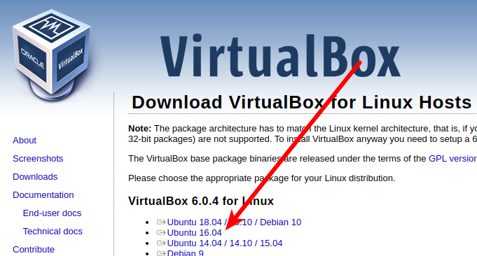

# Prerequisites


In this tutorial, and the upcoming tutorials it will be assumed that Ansible is used inside a [Python Virtual Environment](https://python-guide-cn.readthedocs.io/en/latest/dev/virtualenvs.html). The advantage of this is that we can have a separate set of packages that will be installed in isolation with regards to the operating system, making it very useful to work with different projects and control the dependencies more granularly.

I wrote this using Linux Ubuntu, but the steps should be transferable to any OS you use.

## Create a virtual environment

* Update your package list
  ```
  $ sudo apt-get update
  ```
* Ensure `pip` is installed:
    ```bash
    $ sudo apt-get install python-pip
    ```
* Ensure `virtualenv` is installed:
    ```bash
    $ sudo pip install virtualenv
    ```
* Create a virtual environment using python3, under `~/.venv`
    ```bash
    $ virtualenv -p $( which python3 ) ~/.venv
    ```
    ```Important:: The virtual environment can be created anywhere in your filesystem, and can have any name.
    ```

## Activate a virtual environment


You will be doing this quite often, so please keep this command handy:
```bash
$ source ~/.venv/bin/activate
(.venv) $
```
After this you will notice how the Linux prompt has changed, adding `(.venv)` at the beginning.

### Deactivate a virtual environment

To deactivate the virtual environment simply run:
```bash
(.venv) $ deactivate
$
```
After this you will notice how the Linux prompt returns to its original state.

```Important:: **Note**: for the purpose of this tutorial **leave the virtual environment activated** at all times.
```

## Install Ansible (inside a Python virtual environment)

Get the latest stable release (2.7 at the moment of this guide):
```bash
(.venv) $ pip install ansible
```

Verify Ansible has been intalled:
```bash
(.venv) $ ansible --version
ansible 2.7.6
```

## Install VirtualBox

We'll use VirtualBox as virtualizer on this tutorial. It will help to create small local VMs that we can use to test our playbooks and roles against.

* Download the latest version from the website [here](https://www.virtualbox.org/wiki/Linux_Downloads).
  > 
  * Make sure to specify the correct version of your operating system.
* Install the `.deb` file by opening it (or use `$ dpkg -i FILENAME`, making sure to specify the right file name)

## Install Vagrant

We will use vagrant to quickly spin up virtual machines, using VirtualBox as a [provider](https://www.vagrantup.com/docs/providers/) (Vagrant will use it by default). You can think of Vagrant as a VirtualBox wrapper, which can be used to manage virtual machines programmatically. For more info please visit the [Vagrant website](https://www.vagrantup.com/).

* Download the latest version from the [download page](https://releases.hashicorp.com/vagrant/) (2.2.0 at the moment of writing this):
    ```
    $ wget https://releases.hashicorp.com/vagrant/2.2.0/vagrant_2.2.0_linux_amd64.zip
    ```
* Unzip the downloaded file
    ```
    $ unzip vagrant_2.2.0_linux_amd64.zip
    ```
* Add to the user binaries path
    ```
    $ sudo mv vagrant /usr/local/bin/
    ```
* Verify Vagrant has been installed
    ```
    $ vagrant --version
    Vagrant 2.2.0
    ```

## References
- [Python virtual environments](https://docs.python-guide.org/dev/virtualenvs/)
- [Vagrant](https://www.vagrantup.com/)
- [Vagrant cloud](https://app.vagrantup.com/boxes/search)
- [Learn more about Ansible](https://www.ansible.com/how-ansible-works/)
