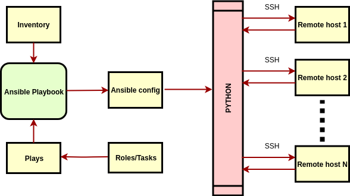

# Terminology

This section will provide with the minimum theory required to work with Ansible.

There are two main modes in which Ansible can be run: [**ad-hoc mode**](#ansible-ad-hoc) and [**playbook mode**](#ansible-playbook). We will make more emphasis in the playbook mode. 

### Ansible Playbook 

Drawn on a diagram, the architecture of Ansible running in playbook-mode would look similar to the following:



#### Basic directory structure
Following the example provided in the [documentation](https://docs.ansible.com/ansible/2.7/user_guide/playbooks_reuse_roles.html), the directory structure of an ansible project can be as follows:
```
site.yml
webservers.yml
fooservers.yml
roles/
   common/
     tasks/
     handlers/
     files/
     templates/
     vars/
     defaults/
     meta/
   webservers/
     tasks/
     defaults/
     meta/
```

#### Inventory

Is where the list of hosts that can be targeted live.

```Important:: It can have a list of IPs, hostnames, a combination of both, and much more. This will be covered more in depth in the inventory section.
```

#### Ansible Playbook file

It's either a `.yml` or `.yaml` file that contains one or more plays. On the list above, the files `site.yml`, `webserver.yml`, and `fooservers.yml` are playbooks.

#### Plays

Can contain one or more tasks, and one or more roles.

#### Roles

Contain a set of grouped tasks that can be reused in many plays. On the list above the roles presented are: `common` and `webservers`.

Focusing on the `roles` directory for a moment, let's point out some things:
* The minimum set of directories that you need for an Ansible role, using the role `common` as an example, is:
    ```
    roles
    └── common
        └── tasks
            └── main.yml

    2 directories, 1 file
    ```
* The file `tasks/main.yml` will be the entry point for the role.
  ```Note:: Any role must have at least a tasks/main.yml file.
  ```
* I usually start filling up this `main.yml` file and then create all other files/directories when necessary (for example, in this case if I needed a template I'd create a `common/templates/` directory and place it there).

```eval_rst

.. important::
   **Why use this directory structure on the roles and not something else?**

   The Ansible modules will typically assume this directory structure convention to find the resources, therefore chances are you'll get an error if a resource cannot be accessed because of a different directory structure.
```


#### Tasks

These are the minimum unit of work in Ansible. Ultimately everything is broken down into a set of tasks. A task normally includes a module.

The tasks can be normally placed in two places:
* within a role (in the file `ROLENAME/tasks/main.yml`) 
* directly in a play (by using the object `tasks`)
```Note:: **ROLENAME** is just a placeholder, it makes reference to the name of the role.
```

#### Module

Units that control certain actions available to be performed by Ansible on the target host. This is where Ansible gets its superpowers from.

You can find a list of available modules in [here](https://docs.ansible.com/ansible/latest/modules/modules_by_category.html).

### Ansible ad-hoc

Serves as a way to perform one-off tasks against a group of hosts. Examples: install a apt package on a certain group of hosts.

This can be very useful to debug simple cases such as connectivity among hosts, or even printing the Ansible variables a remote host has available.

The important thing to remember is that any module that is covered in the documentation, can be used as an ad hoc command. This will be covered later in the course.
