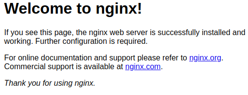

## Best practices and first playbook

### Prerequisites

Create a directory somewhere in your filesystem named `ansible`. 

```eval_rst
.. important:: 
   For the purposes of the tutorial I'll assume it was created on :code:`~/ansible`.
```

```
(.venv) $ mkdir ~/ansible
```

Change directories to the previously created directory.
```
(.venv) $ cd ~/ansible
(.venv) ~/ansible $
```

### Create a role to provision the popular nginx webserver with a sample page

The way to think about a role is as a pre-defined set of tasks that can be controlled with parameters, and included in the plays, which are included on a playbook `.yaml` file.

#### Role `webservers-nginx`

We will name the role to be created as `webservers-nginx`. To proceed let's create the minimum required directory structure for the role:

* Create the file `webservers-nginx/tasks/main.yml`
    ```bash
    (.venv) ~/ansible $ mkdir -p roles/webservers-nginx/tasks/
    (.venv) ~/ansible $ touch roles/webservers-nginx/tasks/main.yml
    ```
* Include the following content in the file `main.yml` (careful with the spaces: YAML is very sensitive with this)
    ```yaml
    ---

    - name: install the nginx reverse proxy
      apt:
        name: nginx
        update_cache: yes

    - name: enable nginx service
      systemd:
        name: nginx
        state: started
        enabled: yes
    ```
    ```eval_rst
    .. warning::
       Do not use tabs as YAML doesn't support them (see here_).
    
    .. _here: https://yaml.org/faq.html

    ```
In this example we're just installing the popular webserver Nginx, starting it, and enabling the service at boot time (so if we reboot the destination host, this service will be auto-started).

### Create a playbook to use the role

Playbooks are the next level of abstraction towards the infrastructure. They include plays. A play can include tasks, and most importantly, roles.

Until now we don't have any hosts to use as target to run the playbook that will have included the role `webservers-nginx`, that's about to change.

#### Creating a virtual machine using Vagrant

With Vagrant we can spin up virtual machines easily. In this case we will spin up a particular Ubuntu Xenial image. See below:

* Initialize vagrant with an ubuntu image:
    ```bash
    (.venv) ~/ansible $ vagrant init bento/ubuntu-16.04 --minimal
    ```
    > This will create the file `Vagrantfile`.
* Open the autogenerated `Vagrantfile`, and make sure the content looks like this:
    ```ruby
    Vagrant.configure("2") do |config|
        config.vm.box = "bento/ubuntu-16.04"
        config.vm.network "forwarded_port", guest: 80, host: 8080
    end
    ```
* Start the virtual machine
    ```bash
    (.venv) ~/ansible $ vagrant up
    ```
    > Time to get a cup of tea in here 
 
The steps above will help to create a local test infrastructure that we can use to run our Ansible playbooks against. This helps in the way that you don't (and shouldn't) need to target your important infrastructure to test a particular playbook (careful with this!).

The flavor of ubuntu downloaded can be seen in [here](https://app.vagrantup.com/bento/boxes/ubuntu-16.04). This image by default has the following ssh credentials:
* Username: `vagrant`
* Password: `vagrant`

After generating the image, we configure an extra port to be forwarded (see Vagrant [forwarded ports](https://www.vagrantup.com/docs/networking/forwarded_ports.html)). This will enable us to:
* Access the vagrant host via `ssh` by doing `ssh localhost -p 2222`, so we don't need to know the IP of the host that was just created. If you know the IP that was created then the traditional `ssh [user]@[hostname or IP]` will work as well. 
* Access the port `80` inside the virtual machine by doing `curl localhost:8080`. Similarly, if you know the IP that was created the traditional `curl [hostname or IP]:80` will work as well. We will mainly access this from the local browser (on port 8080).

Behind the scenes Vagrant is using [Virtualbox](https://www.virtualbox.org/wiki/VirtualBox) as a default virtualizer, therefore if you open the virtual box interface you should see the machine running.


#### Simple inventory file

The playbook we are going to create needs an inventory file, therefore we will create a tiny one and put the minimun content (this will be covered better in the next chapter).

* Create the inventor file:
    ```bash
    (.venv) ~/ansible $ mkdir inventory
    (.venv) ~/ansible $ touch inventory/hosts
    ```
* Include the following content in the file:
    ```ini
    # Simple inventory
    [nginx_webservers]
    127.0.0.1


    [all:vars]
    ansible_connection=ssh
    ansible_ssh_port=2222
    ansible_user=vagrant
    ansible_ssh_pass=vagrant
    ansible_ssh_common_args='-o StrictHostKeyChecking=no'
    ```

<br/>
After we have the inventory file, and the infrastructure ready, we are ready to create our first playbook.

* Create the file `webservers.yml`:
    ```
    (.venv) ~/ansible $ touch webservers.yml
    ```
* Include the following content in the file:
    ```yaml
    ---
        
    - hosts: nginx_webservers
      become: yes
      tasks:
        - include_role:
          name: webservers-nginx    
    ```
* Run the playbook:
    ```bash
    (.venv) ~/ansible $ ansible-playbook -i inventory/hosts webservers.yml
    ```

The output of running the playbook should be:
```bash
PLAY [nginx_webservers] **************************************************************************************************************************************************************************************************************

TASK [Gathering Facts] ***************************************************************************************************************************************************************************************************************
ok: [127.0.0.1]

TASK [include_role : webservers-nginx] ***********************************************************************************************************************************************************************************************

TASK [webservers-nginx : install the nginx reverse proxy] ****************************************************************************************************************************************************************************
changed: [127.0.0.1]

TASK [webservers-nginx : enable nginx service] ***************************************************************************************************************************************************************************************
ok: [127.0.0.1]

PLAY RECAP ***************************************************************************************************************************************************************************************************************************
127.0.0.1                  : ok=3    changed=1    unreachable=0    failed=0   
```

To confirm everything has worked fine, if you access http://localhost:8080 this should display the popular Nginx welcome page:




### References
- [Python virtual environments](https://docs.python-guide.org/dev/virtualenvs/)
- [Vagrant](https://www.vagrantup.com/)
- [Vagrant cloud](https://app.vagrantup.com/boxes/search)
- [Learn more about Ansible](https://www.ansible.com/how-ansible-works/)
- [Ansible documentation](http://docs.ansible.com/)
